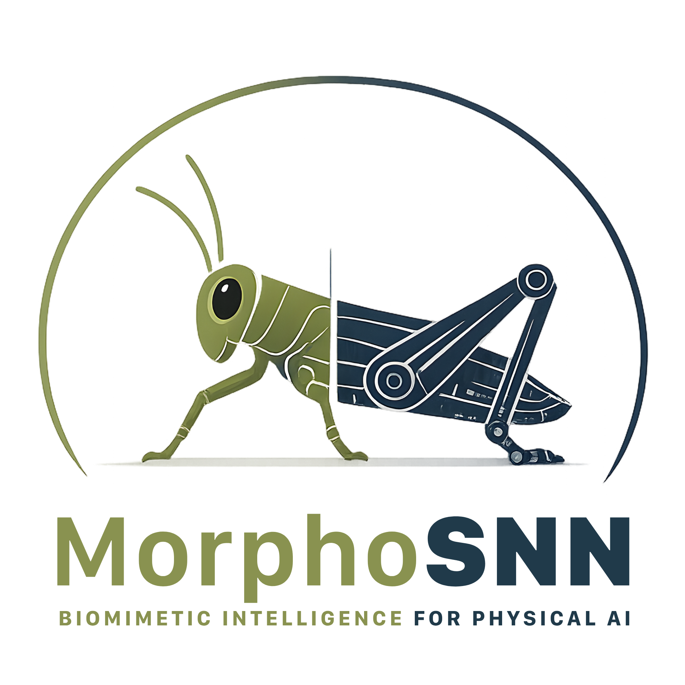

# MorphoSNN Core

<p align="center">
  
</p>

<p align="center">
  <a href="./README.md">English</a> |
  <a href="./README.ko.md">한국어</a>
</p>

# MorphoSNN Core

Bio-inspired Distributed Neuromorphic Physical AI

## 개요

MorphoSNN Core는 Physical AI를 위한 bio-inspired distributed neuromorphic control stack의 공개 seed reference repository입니다.

MorphoSNN은 high-level AI planning과 physical actuation 사이에 위치하는 body-near intelligence layer에 초점을 둡니다. 이 layer는 local rhythm generation, reflex-like sensory correction, neuromodulation, morphology-aware adaptation을 다룹니다.

본 프로젝트는 biomimetic design principles를 사용하지만, 생물학적 신경계를 1:1로 복제하려는 것이 아닙니다. 대신 절지동물의 distributed motor-control principles—segmental ganglia, central pattern generators, sensory feedback, efference copy, neuromodulation, morphological computation—을 공학적으로 추상화하여 modular SNN-based control architecture로 전환하는 것을 목표로 합니다.

## 왜 MorphoSNN인가

Physical AI는 더 큰 중앙 모델만으로 해결되지 않습니다. 실제 물리 환경에서는 지연, 접촉, 변형, 미끄러짐, 충격, 센서 노이즈, 데이터 부족이 동시에 발생합니다. MorphoSNN은 이런 문제를 high-level planner가 모두 처리하기보다, 신체 가까이의 분산 제어 layer가 일부를 담당해야 한다는 가설에서 출발합니다.

## 핵심 구조

| Layer | Role |
|---|---|
| Body Graph Layer | 모듈, 센서, 액추에이터, morphology를 표현 |
| Local CPG / SNN Controller Layer | local rhythmic primitive 생성 |
| Sensory Reflex Loop Layer | reflex-like sensory correction 수행 |
| Forward Model / Efference Copy Layer | 예측된 감각 결과와 관측된 결과 비교 |
| Neuromodulation / Global Coordination Layer | local controller를 직접 micromanage하지 않고 parameter/bias 수준에서 조정 |
| Morphology-Aware Validation Layer | 제어 출력과 물리적 morphology, compliance, benchmark를 연결 |

## 먼저 읽을 문서

| 목적 | 문서 |
|---|---|
| 프로젝트 thesis 이해 | [docs/00_CONCEPT.md](docs/00_CONCEPT.md) |
| architecture 이해 | [docs/01_ARCHITECTURE.md](docs/01_ARCHITECTURE.md) |
| 생물학적 근거 이해 | [docs/02_BIOLOGICAL_INSPIRATION.md](docs/02_BIOLOGICAL_INSPIRATION.md) |
| benchmark 방향 이해 | [docs/03_BENCHMARK_PROTOCOL.md](docs/03_BENCHMARK_PROTOCOL.md) |
| validation pathway 이해 | [docs/04_EPFL_RRL_VALIDATION.md](docs/04_EPFL_RRL_VALIDATION.md) |
| roadmap 확인 | [docs/05_ROADMAP.md](docs/05_ROADMAP.md) |
| seed specification 확인 | [SPEC.md](SPEC.md) |
| design decisions 확인 | [docs/decisions/](docs/decisions/) |
| toy example 실행 | [examples/toy_cpg_controller/](examples/toy_cpg_controller/) |
| references 확인 | [research/bibliography/references.md](research/bibliography/references.md) |

## 현재 상태

MorphoSNN Core는 현재 seed reference repository입니다. 이 repo는 public concept documents, seed specification, design decision records, scientific foundation notes, draft benchmark protocol, KPI table, public references, toy CPG example을 포함합니다.

현재 release:

- v0.1.0-seed: https://github.com/hkalbertkim/morphosnn-core/releases/tag/v0.1.0-seed

## 포함된 내용

- README 및 한국어 README
- SPEC.md
- architecture / concept / benchmark / roadmap 문서
- ADR 기반 design decisions
- scientific foundation notes
- public conceptual slide materials
- draft benchmark protocol
- KPI table
- toy CPG oscillator example
- public bibliography
- contribution guide, security policy, issue templates

## 실행 예제

Toy CPG example:

```bash
python3 examples/toy_cpg_controller/cpg_oscillator.py
```

이 예제는 anti-phase rhythmic primitive generation을 보여주는 최소 예제입니다. 생물학적 시뮬레이션도 아니고, 실제 로봇 제어기도 아닙니다.

Sample output은 [examples/toy_cpg_controller/sample_output.csv](examples/toy_cpg_controller/sample_output.csv)에서 확인할 수 있습니다.

## 비목표

MorphoSNN Core v0.1.0-seed는 다음을 주장하지 않습니다.

- 생물학적 신경계의 1:1 복제
- 검증 완료된 robotics benchmark
- 임의의 물리 시스템에 대한 zero-shot 또는 few-shot adaptation 보장
- partner-confidential data, unpublished experimental results, proprietary hardware details 포함
- high-level AI planning system 대체

MorphoSNN은 high-level planning과 physical actuation 사이의 body-near control layer에 초점을 둡니다.

## 라이선스

Apache-2.0
