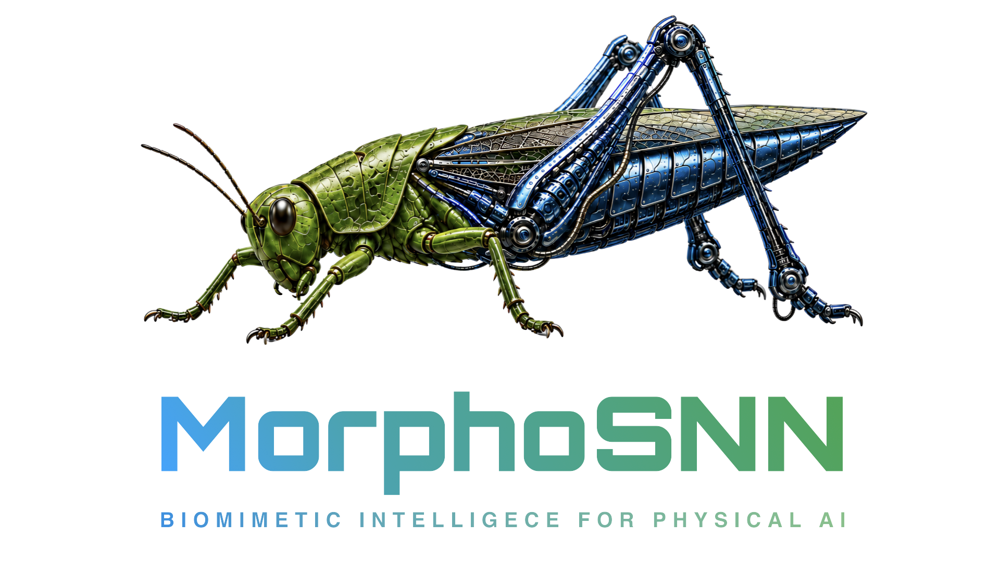

# MorphoSNN Core

<p align="center">
  
</p>

<p align="center">
  <a href="./README.md">English</a> |
  <a href="./README.ko.md">한국어</a>
</p>

<p align="center">
  <b>생물 영감 기반 분산형 뉴로모픽 물리 AI</b>
</p>

## 개요

MorphoSNN Core는 물리적 인공지능(Physical AI)을 위한 생물 영감 기반(bio-inspired) 분산형 뉴로모픽 제어 스택의 초기 공개 기준 저장소입니다.

MorphoSNN은 상위 AI 계획(high-level AI planning)과 물리 구동(physical actuation) 사이에 위치하는 신체 근접 지능 계층(body-near intelligence layer)에 초점을 둡니다. 이 계층은 국소 리듬 생성, 반사 유사 감각 보정, 신경조절, 형태 인식 적응을 다룹니다.


전체 시각 개념 세트는 [docs/10_NEUROMORPHIC_STRATEGIC_THESIS.md](docs/10_NEUROMORPHIC_STRATEGIC_THESIS.md)에서 확인할 수 있습니다.

## 비주얼 컨셉 스토리

MorphoSNN은 문제 정의, 곤충 기반 설계 원리, 연구 접근법, task-family 로드맵, 오픈 플랫폼 방향을 설명하는 6장 구성의 비주얼 컨셉 세트를 제공합니다.

전체 비주얼 스토리는 [`docs/10_NEUROMORPHIC_STRATEGIC_THESIS.md`](docs/10_NEUROMORPHIC_STRATEGIC_THESIS.md)에서 확인할 수 있습니다.

본 프로젝트는 생체모방 설계 원리(biomimetic design principles)를 사용하지만, 생물학적 신경계를 1:1로 복제하려는 프로젝트가 아닙니다. 대신 절지동물의 분산 운동제어 원리, 즉 체절 신경절, 중앙 패턴 생성기(CPG), 감각 피드백, 운동명령 복사본, 신경조절, 형태학적 연산을 공학적으로 추상화하여 모듈형 스파이킹 신경망(SNN) 기반 제어 구조로 전환하는 것을 목표로 합니다.

## 왜 MorphoSNN인가

물리적 인공지능은 더 큰 중앙 모델만으로 해결되지 않습니다. 실제 물리 환경에서는 지연, 접촉, 변형, 미끄러짐, 충격, 센서 노이즈, 데이터 부족이 동시에 발생합니다.

MorphoSNN은 이러한 문제를 상위 계획기가 모두 처리하기보다, 신체 가까이에서 작동하는 분산 제어 계층이 일부를 담당해야 한다는 관점에서 출발합니다. 핵심 가설은 다음과 같습니다.

> Physical AI does not only need bigger brains. It needs body-near local nervous systems.

한국어로 말하면, 물리적 인공지능에는 더 큰 두뇌뿐 아니라 신체 가까이에서 빠르게 반응하는 국소 신경계가 필요합니다.

## 연구 지향 표현 프레이밍

MorphoSNN은 로봇 제어 스택만을 의미하지 않습니다. 공개 연구 프레이밍은 로봇을 첫 번째 제한된 과제군(task-family)으로 사용하여, 신경 매니폴드(neural manifold)에서 영감을 받은 표현 기하가 ANN/SNN 표현 정렬 지표, 분산 제어 원리, 측정 가능한 과제 효율 신호로 전환될 수 있는지를 검토하는 것입니다.

의도된 연구 파이프라인은 다음과 같습니다.

생물학적 Neural Manifold 기하 정량화
-> ANN/SNN 표현 정렬 및 유사도 지표
-> 표현 기하와 과제 효율 사이의 관계 분석
-> 오픈소스 기준 스택 및 설계 가이드라인

과제 효율 신호에는 일반화, 표본 복잡도, 계산 또는 에너지 프록시, 강건성, 국소 적응 등이 포함될 수 있습니다. 이는 현재 검증 완료된 로봇 성능 주장이 아니라, 초기 방향(seed direction), 제안된 프레이밍(proposed framing), 의도된 기준 스택(intended reference stack) 경로입니다.

## 연구 및 검증 맥락

공개 연구 관점의 의도된 역할에서 Axonova는 AI/SNN 기준 스택 통합 주체로 서술됩니다. EPFL/RRL은 모듈형, 오리가미, 소프트 로보틱스 테스트베드 전문성을 활용할 수 있는 연구 및 검증 경로 맥락으로 논의됩니다. MorphoSNN Core는 개념, 지표, 성능평가 스캐폴딩, 예제를 담는 공개 초기 기준 스택 저장소입니다.

이 공개 저장소는 공식 후원, 선정, 검증 완료, 기밀 협력 조건을 주장하지 않습니다. 또한 기관의 공식 지지, 확정된 협력기관 산출물, 완료된 파트너 검증을 주장하지 않습니다. 기관 로고는 사용 권한 확인 전까지 공개 저장소에 포함하지 않습니다.

## 뉴로모픽 전략 가설

MorphoSNN은 뉴로모픽 AI가 이론 모델이나 디바이스 수준 시연만으로는 확산되기 어렵고, 구체적인 task-family benchmark가 필요하다는 문제의식에서 출발합니다. 딥러닝이 ImageNet/AlexNet과 같은 benchmark moment를 통해 특정 영역에서 학습된 표현의 효과를 입증하며 확산된 것처럼, MorphoSNN은 로보틱스를 첫 번째 제한된 task-family로 사용하여 neural-manifold 기반 표현기하가 ANN/SNN 정렬, 분산 제어 원리, 측정 가능한 task-efficiency signal로 연결될 수 있는지 검증하려는 seed reference-stack입니다. 이는 AlexNet 수준의 성과를 주장하는 것이 아니라, 뉴로모픽 AI를 검증 가능한 연구개발 구조로 전환하기 위한 전략 가설입니다.

전략 가설 문서: [docs/10_NEUROMORPHIC_STRATEGIC_THESIS.md](docs/10_NEUROMORPHIC_STRATEGIC_THESIS.md)

## 핵심 구조

| 계층 | 역할 |
|---|---|
| 신체 그래프 계층 | 모듈, 센서, 액추에이터, 형태 정보를 표현 |
| 국소 CPG / SNN 제어 계층 | 국소 리듬 기본 패턴 생성 |
| 감각 반사 루프 계층 | 반사 유사 감각 보정 수행 |
| 순방향 모델 / 운동명령 복사본 계층 | 예측된 감각 결과와 실제 관측 결과 비교 |
| 신경조절 / 전역 조정 계층 | 각 액추에이터를 직접 미세 제어하지 않고, 국소 제어기의 파라미터와 편향을 조정 |
| 형태 인식 검증 계층 | 제어 출력과 물리적 형태, 유연성, 성능평가 기준을 연결 |

## 먼저 읽을 문서

| 목적 | 문서 |
|---|---|
| 프로젝트 핵심 가설 이해 | [docs/00_CONCEPT.md](docs/00_CONCEPT.md) |
| 시스템 구조 이해 | [docs/01_ARCHITECTURE.md](docs/01_ARCHITECTURE.md) |
| 생물학적 근거 이해 | [docs/02_BIOLOGICAL_INSPIRATION.md](docs/02_BIOLOGICAL_INSPIRATION.md) |
| 성능평가 방향 이해 | [docs/03_BENCHMARK_PROTOCOL.md](docs/03_BENCHMARK_PROTOCOL.md) |
| 검증 경로 이해 | [docs/04_EPFL_RRL_VALIDATION.md](docs/04_EPFL_RRL_VALIDATION.md) |
| 개발 로드맵 확인 | [docs/05_ROADMAP.md](docs/05_ROADMAP.md) |
| 신경 매니폴드 프레이밍 이해 | [docs/06_NEURAL_MANIFOLD_ALIGNMENT.md](docs/06_NEURAL_MANIFOLD_ALIGNMENT.md), [docs/07_TASK_FAMILY_RATIONALE.md](docs/07_TASK_FAMILY_RATIONALE.md), [docs/08_CONSORTIUM_ROLES.md](docs/08_CONSORTIUM_ROLES.md), [docs/09_EPFL_RRL_EXTENSION_NOTE.md](docs/09_EPFL_RRL_EXTENSION_NOTE.md) |
| 뉴로모픽 전략 가설 이해 | [docs/10_NEUROMORPHIC_STRATEGIC_THESIS.md](docs/10_NEUROMORPHIC_STRATEGIC_THESIS.md) |
| 초기 기술 명세 확인 | [SPEC.md](SPEC.md) |
| 설계 결정 기록 확인 | [docs/decisions/](docs/decisions/) |
| CPG 리듬 생성 예제 실행 | [examples/toy_cpg_controller/](examples/toy_cpg_controller/) |
| 참고문헌 확인 | [research/bibliography/references.md](research/bibliography/references.md) |

## 현재 상태

MorphoSNN Core는 현재 초기 공개 기준 저장소입니다. 이 저장소는 공개 개념 문서, 초기 기술 명세, 설계 결정 기록, 과학적 기초 노트, 성능평가 프로토콜 초안, KPI 표, 공개 참고문헌, CPG 리듬 생성 예제를 포함합니다.

현재 릴리즈:

- [v0.1.0-seed](https://github.com/hkalbertkim/morphosnn-core/releases/tag/v0.1.0-seed)

## 포함된 내용

- 영어 README 및 한국어 README
- 초기 기술 명세(`SPEC.md`)
- 구조, 개념, 성능평가, 검증 경로, 로드맵 문서
- ADR 기반 설계 결정 기록
- 과학적 기초 노트
- 공개 가능한 개념 슬라이드 자료
- 성능평가 프로토콜 초안
- KPI 표
- CPG 리듬 생성 예제
- 공개 참고문헌
- 기여 가이드, 보안 정책, 이슈 템플릿

## 실행 예제

CPG 리듬 생성 예제:

```bash
python3 examples/toy_cpg_controller/cpg_oscillator.py
```

이 예제는 서로 반대 위상으로 움직이는 리듬 기본 패턴을 보여주는 최소 예제입니다. 생물학적 시뮬레이션도 아니고, 실제 로봇 제어기도 아닙니다.

재현성 확인용 샘플 출력은 [examples/toy_cpg_controller/sample_output.csv](examples/toy_cpg_controller/sample_output.csv)에서 확인할 수 있습니다.

## 비목표

MorphoSNN Core v0.1.0-seed는 다음을 주장하지 않습니다.

- 생물학적 신경계의 1:1 복제
- 검증 완료된 로봇 성능평가
- 임의의 물리 시스템에 대한 제로샷(zero-shot) 또는 퓨샷(few-shot) 적응 보장
- 협력기관 기밀 데이터, 미공개 실험 결과, 독점 하드웨어 세부 정보 포함
- 상위 AI 계획 시스템 대체

MorphoSNN은 상위 계획과 물리 구동 사이의 신체 근접 제어 계층에 초점을 둡니다.

## 라이선스

Apache-2.0
