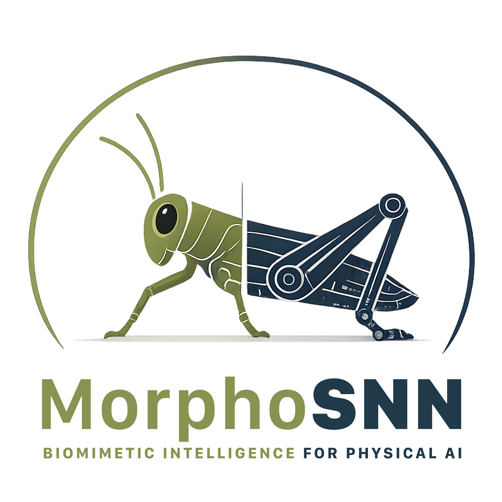
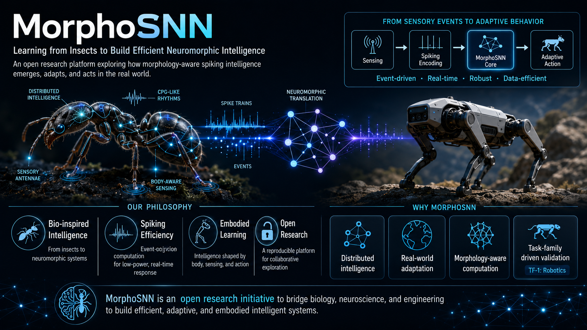
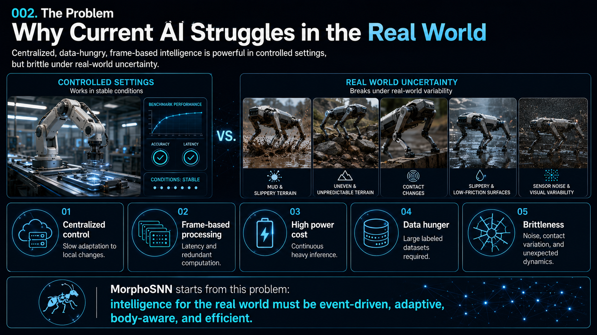
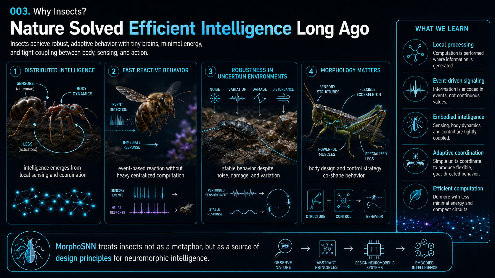
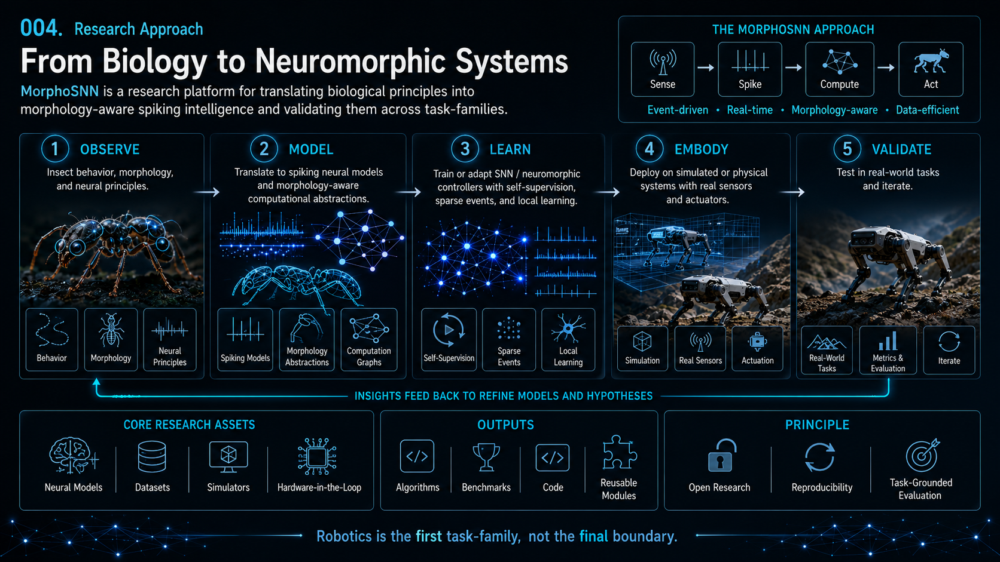
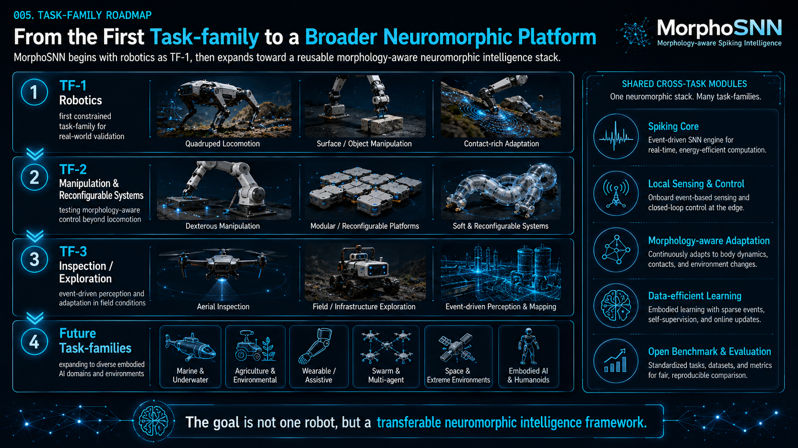
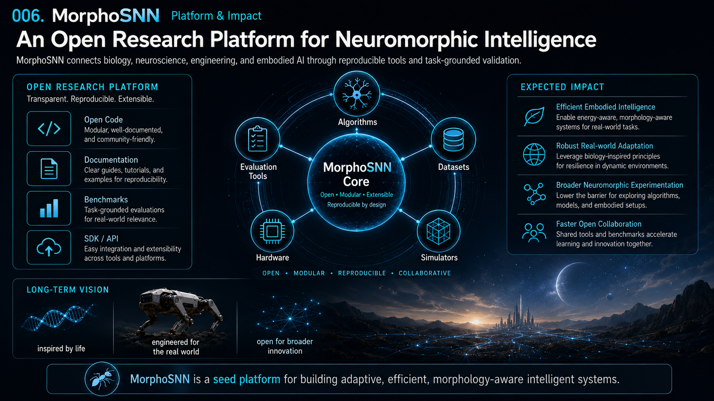

  

  
  
  
  
  
  

  <a href="./README.md">English</a> |
  <a href="./README.ko.md">한국어</a>

<h3 align="center">Bio-inspired Distributed Neuromorphic Physical AI</h3>

## Overview

MorphoSNN is a bio-inspired distributed neuromorphic control stack for physical AI.

MorphoSNN focuses on the missing body-near intelligence layer between high-level AI planning and physical actuation: local rhythm generation, reflex-like sensory correction, neuromodulation, and morphology-aware adaptation.

See the full visual concept set in [docs/10_NEUROMORPHIC_STRATEGIC_THESIS.md](docs/10_NEUROMORPHIC_STRATEGIC_THESIS.md).

## Visual Concept Story

The following visual sequence summarizes the MorphoSNN thesis: why current AI struggles in real-world physical environments, why insects provide useful design principles, how those principles are translated into neuromorphic systems, and how robotics serves as the first constrained task-family for validation.

### 1. The Problem: Current AI Struggles in the Real World

Centralized, data-hungry, frame-based intelligence can perform well in controlled settings, but physical systems must handle contact changes, sensor noise, terrain variation, latency, and local adaptation.

### 2. Why Insects: Efficient Intelligence from Biology

Insects provide design principles for distributed intelligence, fast event-driven behavior, robust adaptation, and morphology-aware control under severe resource constraints.

### 3. Research Approach: From Biology to Neuromorphic Systems

MorphoSNN studies biological principles, abstracts them into morphology-aware spiking models, learns from sparse events, embodies the models in simulated or physical systems, and validates behavior through task-grounded evaluation.

### 4. Task-Family Roadmap: Robotics as TF-1

Robotics is the first constrained task-family for real-world validation, but the goal is a transferable neuromorphic intelligence framework across multiple embodied domains.

### 5. Platform and Impact: Open Neuromorphic Research

MorphoSNN is structured as an open research platform that connects algorithms, datasets, simulators, hardware, evaluation tools, documentation, and reusable benchmarks.

The project uses biomimetic design principles, but does not attempt to reproduce biological nervous systems one-to-one. Instead, it abstracts distributed motor-control principles from arthropod nervous systems—segmental ganglia, central pattern generators, sensory feedback, efference copy, neuromodulation, and morphological computation—into modular SNN-based control architectures.

## Why MorphoSNN

Modern AI systems are increasingly capable of high-level perception, planning, and decision-making, but physical systems still need fast, local, body-aware control. MorphoSNN treats this body-near layer as a first-class design problem rather than a low-level implementation detail.

The seed repository organizes the concepts, architecture, examples, and research notes needed to develop that layer in a public, implementation-ready form.

## Core Thesis

Physical AI benefits from distributed control modules that are close to the body, coupled through morphology, and modulated by higher-level context. In MorphoSNN, local rhythmic primitives, sensory correction, forward prediction, and morphology-aware validation are treated as complementary parts of one neuromechanical control stack.

## Research-Oriented Representation Framing

MorphoSNN is not only a robotics control stack. The research framing is to use robotics as a first constrained task-family for testing whether neural-manifold-inspired representation geometry can be translated into ANN/SNN alignment metrics, distributed control principles, and measurable task-efficiency signals.

The intended research pipeline is:

Biological Neural Manifold geometry quantification
-> ANN/SNN representation alignment and similarity metrics
-> relation between representation geometry and task efficiency
-> open-source reference stack and design guideline

Task-efficiency signals may include generalization, sample complexity, computation or energy proxy, robustness, and local adaptation. This remains a seed direction and intended reference-stack path, not yet a validated robotics result or a claim of biological fidelity.

## Research & Validation Context

In the open research framing, Axonova is the intended AI/SNN reference-stack integrator. EPFL/RRL is discussed as a research and validation-pathway context using modular, origami, and soft robotics testbed expertise. MorphoSNN Core is the public seed reference-stack repository for concepts, metrics, benchmark scaffolding, and examples.

The public repository does not claim awarded funding, institutional endorsement, committed partner deliverables, or completed partner validation. Institutional logos are not included in the public repository unless permission and usage rights are confirmed.

## Neuromorphic Strategy Thesis

MorphoSNN is motivated by the view that neuromorphic AI needs concrete task-family benchmarks, not only theoretical models or device-level demonstrations. Deep learning became broadly credible after benchmark moments such as ImageNet/AlexNet showed that learned representations could outperform prior approaches in a specific domain. MorphoSNN does not claim an equivalent breakthrough. Instead, it uses robotics as a first constrained task-family to test whether neural-manifold-inspired representation geometry can be connected to ANN/SNN alignment, distributed control principles, and measurable task-efficiency signals.

Read the strategy thesis: [docs/10_NEUROMORPHIC_STRATEGIC_THESIS.md](docs/10_NEUROMORPHIC_STRATEGIC_THESIS.md).

## Architecture

| Layer | Role |
|---|---|
| Body Graph Layer | Represents modules, sensors, actuators, and morphology |
| Local CPG / SNN Controller Layer | Generates local rhythmic primitives |
| Sensory Reflex Loop Layer | Performs reflex-like sensory correction |
| Forward Model / Efference Copy Layer | Compares predicted and observed sensory outcomes |
| Neuromodulation / Global Coordination Layer | Modulates local controllers without micromanaging every actuator |
| Morphology-Aware Validation Layer | Connects control outputs to physical morphology and benchmarks |

## Scientific Foundations

MorphoSNN is informed by distributed motor-control ideas from arthropod nervous systems, central pattern generators, sensory feedback loops, efference copy, neuromodulation, and morphological computation.

These ideas are used as engineering abstractions. The project does not claim biological fidelity, validated robotics performance, or guaranteed transfer across arbitrary bodies.

## Start Here

| Goal | Read |
|---|---|
| Understand the project thesis | [docs/00_CONCEPT.md](docs/00_CONCEPT.md) |
| Understand the architecture | [docs/01_ARCHITECTURE.md](docs/01_ARCHITECTURE.md) |
| Understand the biological basis | [docs/02_BIOLOGICAL_INSPIRATION.md](docs/02_BIOLOGICAL_INSPIRATION.md) |
| Understand benchmark direction | [docs/03_BENCHMARK_PROTOCOL.md](docs/03_BENCHMARK_PROTOCOL.md) |
| Understand validation pathway | [docs/04_EPFL_RRL_VALIDATION.md](docs/04_EPFL_RRL_VALIDATION.md) |
| Understand roadmap | [docs/05_ROADMAP.md](docs/05_ROADMAP.md) |
| Understand neural-manifold framing | [docs/06_NEURAL_MANIFOLD_ALIGNMENT.md](docs/06_NEURAL_MANIFOLD_ALIGNMENT.md), [docs/07_TASK_FAMILY_RATIONALE.md](docs/07_TASK_FAMILY_RATIONALE.md), [docs/08_CONSORTIUM_ROLES.md](docs/08_CONSORTIUM_ROLES.md), [docs/09_EPFL_RRL_EXTENSION_NOTE.md](docs/09_EPFL_RRL_EXTENSION_NOTE.md) |
| Understand neuromorphic strategy thesis | [docs/10_NEUROMORPHIC_STRATEGIC_THESIS.md](docs/10_NEUROMORPHIC_STRATEGIC_THESIS.md) |
| Read the seed specification | [SPEC.md](SPEC.md) |
| Read design decisions | [docs/decisions/](docs/decisions/) |
| Run the toy example | [examples/toy_cpg_controller/](examples/toy_cpg_controller/) |
| Review references | [research/bibliography/references.md](research/bibliography/references.md) |

## Repository Structure

- [assets/](assets/) - Project logos and visual assets.
- [docs/](docs/) - Concept, architecture, validation, benchmark, roadmap, and design-decision documentation.
- [research/](research/) - Public research notes, conceptual slide materials, and bibliography scaffolding.
- [examples/](examples/) - Minimal runnable examples that illustrate core abstractions.
- [benchmarks/](benchmarks/) - KPI tables and benchmark protocol artifacts.
- [paper/](paper/) - Technical note and publication-oriented drafts.

## Current Status

MorphoSNN Core is currently a seed reference repository. It contains public concept documents, a seed specification, design decision records, scientific foundation notes, a draft benchmark protocol, and a toy CPG example. It is not yet a validated robotics benchmark or deployment-ready control stack.

The toy CPG oscillator includes a reproducible sample output trace at [examples/toy_cpg_controller/sample_output.csv](examples/toy_cpg_controller/sample_output.csv).

## Non-goals

MorphoSNN is currently a seed reference stack. It does not claim to:

- reproduce biological nervous systems one-to-one;
- provide a validated robotics benchmark yet;
- guarantee zero-shot or few-shot adaptation across arbitrary physical systems;
- include partner-specific confidential data, unpublished results, or proprietary hardware designs;
- replace high-level AI planning systems. MorphoSNN focuses on the body-near control layer between high-level planning and physical actuation.

## Roadmap

- Refine the body graph and local controller interfaces.
- Expand the toy CPG example into a small testable controller abstraction.
- Populate the bibliography with primary scientific and technical references.
- Define benchmark metrics before claiming robotics validation.
- Keep public core materials separated from private deployments and partner-sensitive research.

## License

This project is licensed under the Apache License 2.0. See [LICENSE](LICENSE).
