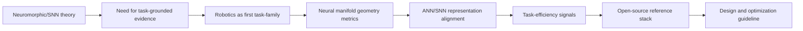
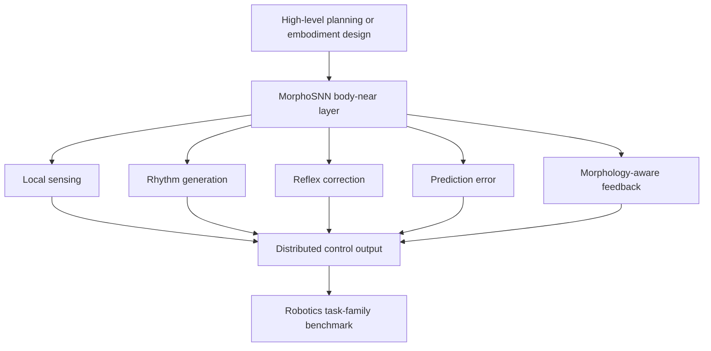

# Toward Task-Grounded Neuromorphic AI

A public research thesis for turning neural-manifold geometry, ANN/SNN alignment, and embodied task-family benchmarks into a neuromorphic AI reference stack.

## 1. Core Thesis

Neuromorphic computing and SNN research have strong theoretical and engineering foundations. Existing work often focuses on device-level demonstrations, isolated SNN models, or benchmark-specific classifiers.

The missing layer is a reproducible path from biological representation geometry to ANN/SNN design rules, task-efficiency metrics, and embodied validation.

MorphoSNN starts from the thesis that neuromorphic AI needs not only better chips or more biologically faithful models, but also task-grounded reference stacks that connect neural representation geometry, ANN/SNN alignment, and measurable task-efficiency signals.

Robotics is used as the first constrained task-family because it combines local sensing, distributed control, low-latency feedback, energy constraints, morphology-aware adaptation, and physical perturbation recovery.

MorphoSNN is not merely a robotics control stack. It is a seed open-source reference-stack direction for testing whether representation geometry and alignment metrics can support interpretable and efficient AI design. MorphoSNN does not claim to be a completed benchmark breakthrough.

## 2. Why a Task-Family Is Needed

Neural manifold analysis can quantify geometry in general terms. But RFP-level objectives require connecting geometry to task efficiency. That connection is difficult to evaluate without a task or task-family.

Robotics is the first experimental family where representation geometry and task efficiency can be measured together.

| Target | Meaning |
|---|---|
| Interpretability | Whether representation geometry makes controller behavior easier to inspect and compare |
| Generalization | Whether learned or designed representations transfer across related task conditions |
| Sample complexity | Whether useful behavior can be reached with less task data or fewer trials |
| Computation / energy proxy | Whether event activity, sparsity, or runtime cost gives a measurable efficiency signal |
| Robustness | Whether representation structure remains useful under noise, perturbation, or morphology shift |
| Design guideline | Whether measured geometry can inform model architecture, controller layout, or benchmark design |

## 3. Historical Analogy: AlexNet as a Benchmark Moment

Artificial neural networks existed for decades before modern deep learning became broadly credible. Broad adoption required theory, data, compute, algorithms, frameworks, and concrete benchmark evidence.

AlexNet/ImageNet is used only as a historical analogy for a benchmark moment. MorphoSNN does not claim an AlexNet-level result.

The narrow analogy is that neuromorphic AI may need a concrete task-family benchmark moment where SNN and neuromorphic design principles show measurable value beyond theoretical promise. For MorphoSNN, the first candidate task-family is robotics-based embodied distributed control.

## 4. Why Robotics as the First Task-Family

Robotics exposes the limits of purely centralized high-level AI control. It is a strong test setting for evaluating whether neural-manifold-inspired geometry and ANN/SNN alignment can produce useful design principles. Robotics is not the final application boundary.

| Robotics requirement | Why it matters for MorphoSNN |
|---|---|
| Local sensing | Body-near controllers must respond to local sensor state without waiting for all decisions to centralize |
| Low-latency control | Contact, slip, rhythm, and disturbance correction require fast feedback loops |
| Distributed actuation | Multiple local modules create a natural testbed for SNN-style distributed control |
| Morphology-aware adaptation | Body shape, compliance, and module configuration affect what representation geometry is useful |
| Energy constraints | Event activity and sparse computation can be evaluated as task-efficiency proxies |
| Perturbation recovery | Physical variation tests whether representation geometry supports robust correction |

## 5. Relation to EPFL/RRL-Style Embodied Robotics

EPFL/RRL-style modular, origami, soft, and reconfigurable robotics provides a useful conceptual validation context. Such systems naturally involve morphology, deformation, contact-rich interaction, and embodied control.

MorphoSNN does not replace high-level planning, LLM-based embodiment design, or simulation-based optimization. MorphoSNN adds a body-near neuromorphic layer concept.

| Existing robotics direction | MorphoSNN extension |
|---|---|
| Task-conditioned embodiment planning | Adds local representation geometry and body-near control metrics below the planning layer |
| Modular/origami/soft robotics | Provides an embodied validation context for morphology-aware neuromorphic control |
| Simulation-based control optimization | Adds ANN/SNN representation alignment and task-efficiency analysis as evaluation layers |
| LLM-assisted design | Treats high-level design generation as complementary to local sensing and reflex-like control |
| Robotic platform validation | Frames robotics as a research and validation-pathway context, not a claim of completed validation |

EPFL/RRL is discussed as a research and validation-pathway context, not as completed validation, official institutional endorsement, funded participation, or institutional backing.

## 6. RFP-Aligned Technical Pipeline

```text
Biological Neural Manifold
→ Geometry Quantification
→ ANN/SNN Representation Alignment
→ Task-Efficiency Relation
→ Robotics Task-Family Benchmark
→ Open-Source Reference Stack
→ Design and Optimization Guideline
```

| RFP requirement | MorphoSNN interpretation |
|---|---|
| Neural Manifold quantification | Measure representation geometry through intrinsic dimensionality, trajectories, separability, smoothness, stability, and sparsity or event activity proxies |
| Alignment with ANN representation space | Compare biological, ANN, and SNN representations using candidate similarity metrics such as CKA, RSA, and Procrustes-style alignment |
| Interpretability | Use geometry and alignment metrics to make representation structure easier to inspect and compare |
| Efficiency | Relate representation structure to generalization, sample complexity, computation or energy proxy, robustness, and adaptation |
| Relation / bound | Investigate or estimate how geometry metrics relate to task-efficiency signals without claiming that a mathematical bound has already been derived |
| Open-source implementation | Build public docs, examples, metrics, benchmark scaffolding, and reproducible reports as a reference-stack seed |

## 7. Non-Claims

MorphoSNN does not currently claim:

- completed robotics validation;
- confirmed EPFL/RRL funded participation;
- institutional endorsement;
- biological fidelity;
- AlexNet-level benchmark achievement;
- generalization across arbitrary robots or tasks;
- replacement of high-level planning systems;
- production-ready neuromorphic control.

MorphoSNN is a seed reference-stack direction.

## 8. Proposed Diagrams






